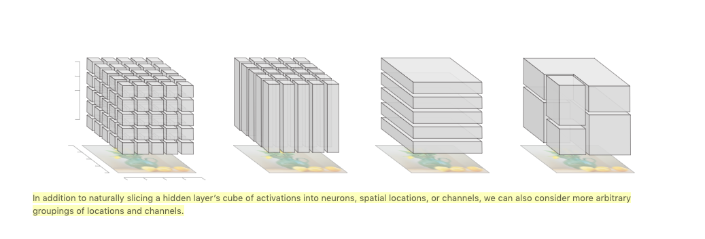

# vision-playground
Playing with CNN architectures, gradient ascent for feature visualization, style transfer and GANs

##Terms
**Semantic Units**: Neurons, Spatial and Channel(detectors), Groups

## Todos
### Visualization Utils

Overall we need a few composable modules that we can extend with new 
visualizations and operations that work on semantic units of the Neural Net. 

First step: Visualize classifier features and attribution based on faces | portraits.
1. Find dataset and/or pretrained model
2. Implement cnn-visualization on top of portrait classifier

https://github.com/utkuozbulak/pytorch-cnn-visualizations
https://distill.pub/2018/building-blocks/

 0. Done-ish: API to get, inject and set layers in arch easily
 1. Sane API to get, compare (eg distance) and aggregate **semantic units** out of most Pytorch Models
 2. Sane Display-API to quickly explore and visualize 1) |> 
 3. Integrate "Guided Backprop", GRADCAM, GRADCAM + Saliency. 
    Code help: https://github.com/utkuozbulak/pytorch-cnn-visualizations#grad-times-image
 4. Semantic Dictionaries,   Matrix factorization (channels, spatial) -> Groups
 
 
##Technical

* Generic Retriever (config -> model specific traversal API)
* Mapping: names <---> NN.classes