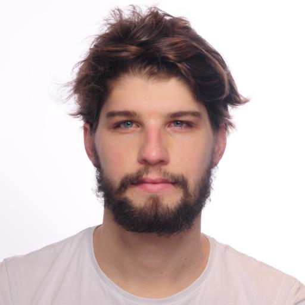
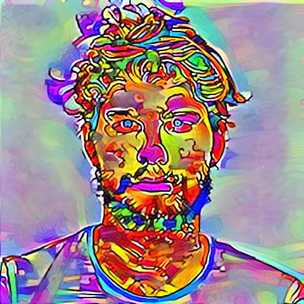

# Netlens v. 1.4.1

*a colab with [Cesar Fuentes](https://github.com/cesarfm) and [Benjamin Durupt](https://github.com/BenjiDur)*

A tool to interpret *neural networks,* featuring all your favorites.

## Overview

[toc]


For the **pro and cons** of these techniques: [Feature Visualization](https://distill.pub/2017/feature-visualization/)


## Interpretation Techniques

### Attribution 

#### Gradients

[Gradient Notebook](nbs/examples/Visual-Gradient_backprop.ipynb)

**Vanilla**


**Guided**


**Smooth BackProp Guided**


**Smooth BackProp Unguided**


**Positive and Negative Saliency**


**Integrated Gradient**


#### GRADCAM

[GradCam Notebook](nbs/examples/Visual-Grad_CAM.ipynb)

**Guided GRADCAM**


**GRADCAM for a specific features of a layer ** *(ReLU-4)*


#### Occlusion

You only know how much you *love -> need* something, once it's *gone -> occluded*.


*imagine something occluded*


### Image Optimization

[Visual Generation Notebook](nbs/examples/Visual-Generation.ipynb)

#### Deep Dreamer


#### Inverted Image (*NetDreamer*)

Generates an Image that maximizes a layer's activations


#### Class Visualization

[Optvis Notebook](nbs/examples/Visual-Generation_with_OptVis.ipynb)

Optimization can give us an example input that causes the desired behavior. If we fixate the "otter" class, we get an image that is optimized to most activate that class.


#### Channel Visualization

[OptVis notebook](nbs/examples/Visual-Generation_with_OptVis.ipynb)

Visualize what a detector (channel) is *looking* for.

| Some Channel                                      | Some other Channel                                | Another Channel Still                             |
| ------------------------------------------------- | ------------------------------------------------- | ------------------------------------------------- |
|  |  |  |


### Bonus: Style Transfer 

As is artist tradition, the best motive is often your muse. Something to hold your attention during those lonely nights of parameterizing your model.

| Muse \| Content                               | Style                                               |
| --------------------------------------------- | --------------------------------------------------- |
|    |  |
|  |      |
|        |      |

Unfortunately, our Image Parameterization (after the last overhaul) is behaving strangely and we didn't have the same beautiful stylizing that would do them justice :( `TODO`

Before that you could get some nice overlays:

| Content (my stupid visage)                                   | Style                                           | Output                    |
| ------------------------------------------------------------ | ----------------------------------------------- | ------------------------- |
|  |  |  |


## Install

`pip install netlens`


The standard image utils (*convert, transform, reshape*) were factored out and put into [pyimgy](https://github.com/cesarfm/pyimgy)


## API

### Building Blocks

`FlatModel`

* A neural network *layer* can be sliced up in many ways:

  

  you can view those as the [semantic units](https://distill.pub/2018/building-blocks/) of the layer / network.

* Pytorch **does not** have a nice API to access layers, channels or store their gradients (*input, weights, bias*). `FlatModel` gives a nicer wrapper that stores the forward and backward gradients in a consistent way.


`Netlens`

* accesses the preprocessed `FlatModel` params to compute and display interpretations


`Hooks`

* abstraction and convenience for `Pytorch's` hook (*aka forward / backward pass callbacks*) API


`NetDreamer`

* filter visualizations, generating images from fixed architecture snapshots. tripping out


`Optim, Param and Renderers`

* General pipeline for `optimizing` images based on an `objective` with a given `parameterization`. 

* used as specific case in `StyleTransfer`:

  ```python
  def generate_style_transfer(module: StyleTransferModule, input_img, num_steps=300, style_weight=1, content_weight=1, tv_weight=0, **kwargs):
      # create objective from the module and the weights
      objective = StyleTransferObjective(module, style_weight, content_weight, tv_weight)
      # the "parameterized" image is the image itself
      param_img = RawParam(input_img, cloned=True)
      render = OptVis(module, objective, optim=optim.LBFGS)
      thresh = (num_steps,) if isinstance(num_steps, int) else num_steps
      return render.vis(param_img, thresh, in_closure=True, callback=STCallback(), **kwargs)
  ```


`StyleTransfer` , **an Artist's Playground**

* streamlined way to run StyleTransfer experiments, which is a specific case of image optimization
* many **variables to configure** (*loss functions, weighting, style and content layers that compute loss, etc.*)


`Adapter`, because there aren't pure functional standards for Deep Learning yet

* We tried to make Netlens work with multiple architectures (*not just VGG or AlexNet*). 

  Still, depending on how the architectures are implemented in the libraries, some techniques work only partially. For example, the hacky, non-functional, imperative implementation of ResNet or DenseNet in Tensorflow and also Pytorch make it hard to do attribution or guided backprop (*ReLu layers get mutated, Nested Blocks aren't pure functions, arbitrary flattening inside forward pass, etc...*).

  `adapter.py` has *nursery* bindings to ingest these special need cases into something the `FlatModel` class can work well with.


### The Code

Composable, elegant code is still seen as `un-pythonic`. Python is easy and productive for small, solo, interactive things and therefore the environment doesn't force users to become better programmers.  

Since it's hard to understand one-off unmaintainable, imperative, throw-away code, which unfortunately is the norm (*even in major deep learning frameworks)*, we put extra effort in making the **code clean, concise and with plenty of comments.**

Don't like it? PRs welcome. 

> Be the change you want to see in the world - Mahatma Gandhi


## Tests
You like everything breaking when you refactor or try out new things?
Exactly. That's why we added some tests as sanity checks. This makes it easier to tinker with the code base.

Run `pytest`or `pytest --disable-pytest-warnings` in the console.
All Tests should be in /tests folder. Imports there are `as if!` from the *basedirectory*. Test files start with `test_...`

If you use `Pycharm` you can change your default test runner to pytest. 


## Prior Art

We came across [cnn-visualizations](https://github.com/utkuozbulak/pytorch-cnn-visualizations) and [flashtorch](https://github.com/MisaOgura/flashtorch/) before deciding to build this.

The codebase  is largely written from scratch, since we wanted all the techniques to work with many models (*most other projects could only work with VGG and/or AlexNet*).  

The `optim, param, renderer` abstraction is inspired by [lucid](https://github.com/tensorflow/lucid)

Research: [distill](www.distill.pub) mostly